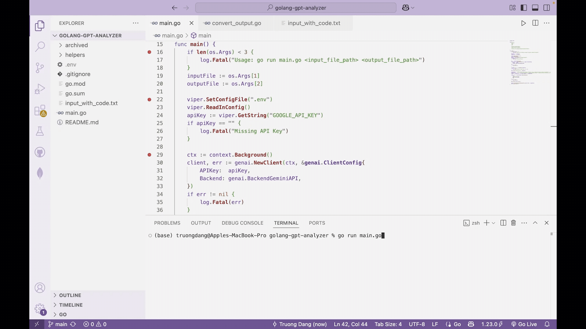

# Golang GPT + Gemini Analyzer

#### 👉🏼 [Link](https://youtu.be/6WfcN37xvho) to demo video on YouTube

## What it does

- Extracted **350,000+ Python libraries** by developing a Golang tool to analyze Python files via the terminal
- Leveraged the **GPT-3.5 Turbo** and **Gemini 2.0 Flash** API for efficient library extraction

## How to run

1. Clone the repo `git clone https://github.com/truongd3/Golang-GPT-Analyzer`.
2. Create an `.env` file and paste your `GOOGLE_API_KEY="YOUR_GOOGLE_API_KEY"`.
3. Generate Google (Gemini) API Key from [Google AI Studio](https://aistudio.google.com/apikey).
4. On the terminal, type `go run main.go <input_file_path> <output_file_path>`. Enter.

## Technologies

- Golang
- GPT-3.5 Turbo API
- Gemini 2.0 Flash API
